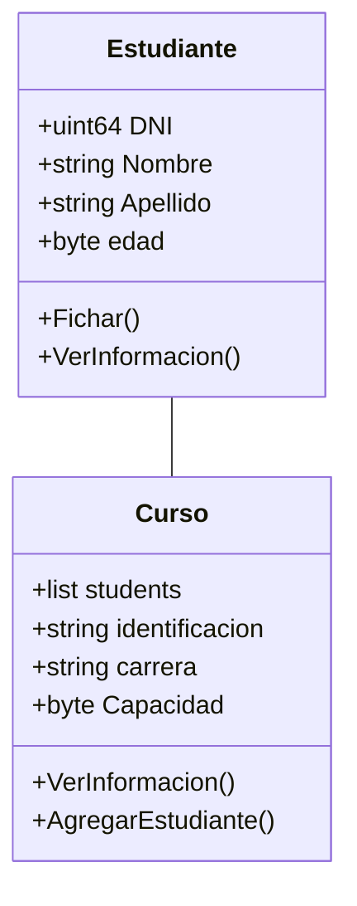

```mermaid
classDiagram
    class Estudiante {
        +uint64 DNI
        +string Nombre
        +string Apellido
        +byte edad
        +Fichar()
        +VerInformacion()
    }

    class Curso {
        +list students
        +string identificacion
        +string carrera
        +byte Capacidad
        +VerInformacion()
        +AgregarEstudiante()
    }
    Estudiante -- Curso
```