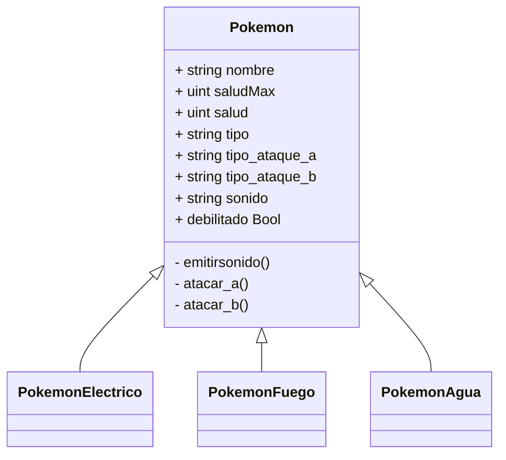

```mermaid
classDiagram 
    class Pokemon {
        + string nombre
        + uint saludMax
        + uint salud
        + string tipo
        + string tipo_ataque_a
        + string tipo_ataque_b
        + string sonido 
        + debilitado Bool 
        - emitirsonido()
        - atacar_a()
        - atacar_b()
    }
    class PokemonElectrico{

    }
    class PokemonFuego {

    }
    class PokemonAgua {

    }

    Pokemon <|-- PokemonElectrico
    Pokemon <|-- PokemonFuego
    Pokemon <|-- PokemonAgua
```